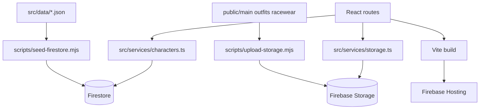

# Umapyoi Calc

Aplicacion web fan-made para consultar informacion de personajes de Umamusume y calcular bonus de herencia.

El proyecto usa Firebase como backend de datos y assets:

- Firestore para documentos de personajes y cards.
- Firebase Storage para imagenes.
- Firebase Hosting para publicar la SPA.

## Que hace este proyecto

- Muestra una base de datos de personajes con cards e imagenes.
- Muestra la ficha detallada de un personaje por ID.
- Incluye una calculadora de inheritance sparks (legacy bonus).
- Incluye una seccion de Support Cards (placeholder actual).

## Estado funcional actual

- Ruta Home: portada del proyecto.
- Ruta Characters: grilla de cards, nombres e imagenes desde Firebase.
- Ruta Character: perfil completo por query param `id`.
- Ruta Inheritance: calculadora visual con puntajes por estrellas.
- Ruta Support: vista base para ampliar en siguientes iteraciones.

## Como funciona internamente



Resumen del flujo:

1. Los scripts admin suben imagenes y siembran JSON en Firebase.
2. El frontend consulta Firestore para metadata y paths.
3. El frontend resuelve esos paths contra Storage para obtener download URLs.
4. Vite genera `dist/` y Hosting sirve la app como SPA.

## Stack tecnologico

| Capa              | Tecnologia                             |
| ----------------- | -------------------------------------- |
| Frontend          | React 19 + TypeScript 6                |
| Build tool        | Vite 8                                 |
| Ruteo             | React Router DOM 7                     |
| UI                | Tailwind CSS 4 + React Icons           |
| Backend SaaS      | Firebase (Firestore, Storage, Hosting) |
| Scripts de datos  | Node.js ESM + firebase-admin           |
| Calidad de codigo | ESLint + typescript-eslint             |

## Estructura del proyecto

```txt
umapyoi-calc/
  public/
    main/
    outfits/
    racewear/
  scripts/
    seed-firestore.mjs
    upload-storage.mjs
  src/
    components/
      Navbar.tsx
      Footer.tsx
    data/
      character_data.json
      card_imgs.json
    lib/
      firebase.ts
    routes/
      Home.tsx
      CharactersCard.tsx
      CharactersInfo.tsx
      InheritanceCalPage.tsx
      SupportCards.tsx
    services/
      characters.ts
      storage.ts
    App.tsx
    main.tsx
  firebase.json
  .firebaserc
  package.json
```

Nota de workspace:

- Si trabajas en un workspace que tambien tiene carpeta `old/`, esa carpeta se usa como referencia legacy.
- Todos los comandos deben correrse dentro de `umapyoi-calc/`.

## Configuracion completa desde cero (paso a paso)

## 1) Requisitos

- Node.js 22 o superior
- npm 11 o superior
- Firebase CLI instalado globalmente

```powershell
npm install -g firebase-tools
```

## 2) Instalar dependencias

```powershell
cd C:\ruta\a\tu\workspace\umapyoi-calc
npm install
```

## 3) Crear variables de entorno frontend

Crea el archivo `.env.local` en la raiz del proyecto con este contenido:

```env
VITE_FIREBASE_API_KEY=TU_API_KEY
VITE_FIREBASE_AUTH_DOMAIN=TU_AUTH_DOMAIN
VITE_FIREBASE_PROJECT_ID=umapyoi-calc-dev
VITE_FIREBASE_STORAGE_BUCKET=umapyoi-calc-dev.firebasestorage.app
VITE_FIREBASE_MESSAGING_SENDER_ID=TU_MESSAGING_SENDER_ID
VITE_FIREBASE_APP_ID=TU_APP_ID

# opcional actualmente
VITE_FIREBASE_MEASUREMENT_ID=TU_MEASUREMENT_ID
```

## 4) Login de Firebase y seleccion de proyecto

```powershell
firebase login --reauth
firebase use
```

Este repo ya trae por defecto:

- Project ID: `umapyoi-calc-dev`
- Hosting target: `umapyoi-calc-dev.web.app`

Si necesitas forzar proyecto:

```powershell
firebase use umapyoi-calc-dev
```

## 5) Levantar el entorno local

```powershell
npm run dev
```

Luego abre la URL que muestra Vite (normalmente `http://localhost:5173`).

## Variables de entorno para scripts admin

Los scripts que escriben en Firebase necesitan Service Account.

```powershell
$env:FIREBASE_SERVICE_ACCOUNT_PATH="C:\ruta\a\tu\service-account.json"
$env:FIREBASE_STORAGE_BUCKET_NAME="umapyoi-calc-dev.firebasestorage.app"
```

Variables opcionales para rutas custom:

```powershell
$env:PUBLIC_DIR="C:\otra\ruta\public"
$env:DATA_DIR="C:\otra\ruta\data"

# aliases legacy todavia soportados
$env:OLD_PUBLIC_DIR="C:\otra\ruta\public"
$env:OLD_DATA_DIR="C:\otra\ruta\data"
```

## Comandos npm disponibles

| Comando                  | Uso                                 |
| ------------------------ | ----------------------------------- |
| `npm run dev`            | Inicia Vite en desarrollo           |
| `npm run build`          | Compila TypeScript y genera `dist/` |
| `npm run preview`        | Sirve build local                   |
| `npm run lint`           | Lint del proyecto                   |
| `npm run upload:storage` | Sube imagenes a Storage             |
| `npm run check:storage`  | Dry-run de subida a Storage         |
| `npm run seed:firestore` | Carga JSON en Firestore             |
| `npm run check:seed`     | Dry-run de seed de Firestore        |
| `npm run check:data`     | Ejecuta ambos dry-run               |
| `npm run sync:data`      | upload:storage + seed:firestore     |
| `npm run deploy:hosting` | build + deploy hosting              |
| `npm run publish:auto`   | sync:data + deploy:hosting          |

## Flujo de datos (assets + Firestore)

Ubicacion esperada de datos locales:

- Imagenes: `public/main`, `public/outfits`, `public/racewear`
- JSON personajes: `src/data/character_data.json`
- JSON cards: `src/data/card_imgs.json`

Fallbacks automaticos de scripts:

- `upload-storage.mjs` usa `public/` y si no existe intenta `../old/public`.
- `seed-firestore.mjs` usa `src/data/` y si no existe intenta `../old/src/data`.

Dry-run recomendado antes de escribir:

```powershell
npm run check:data
```

Escritura real en Firebase:

```powershell
npm run sync:data
```

### Flags utiles de scripts

Ayuda de upload:

```powershell
npm run upload:storage -- -- --help
```

Ayuda de seed:

```powershell
npm run seed:firestore -- -- --help
```

Con npm 11 en PowerShell, usa doble separador `-- --` para reenviar flags.

## Deploy

Deploy solo frontend:

```powershell
npm run deploy:hosting
```

Deploy completo (datos + frontend):

```powershell
npm run publish:auto
```

URL productiva esperada:

- https://umapyoi-calc-dev.web.app

## Troubleshooting rapido

### Error: firebase use must be run from a Firebase project directory

Causa probable: estas fuera de la carpeta del proyecto (sin `firebase.json` y `.firebaserc`).

Solucion:

```powershell
cd C:\ruta\a\tu\workspace\umapyoi-calc
firebase use
```

### Error: Failed to list Firebase projects (401)

Solucion:

```powershell
firebase logout
firebase login --reauth
firebase projects:list
```

### Error: The specified bucket does not exist

- Revisa el bucket real en Firebase Console > Storage.
- Asegura que `FIREBASE_STORAGE_BUCKET_NAME` sea correcto.

### Error npm ENOENT package.json

- Estan ejecutando comandos en carpeta incorrecta.
- Entra a `umapyoi-calc/` antes de correr npm.

## Seguridad

- No subir `.env.local` ni service accounts al repo.
- Las credenciales admin son solo para scripts, nunca para frontend.
- Si una llave se expone, revocarla y generar una nueva de inmediato.

## Ruta de codigo clave

- `src/lib/firebase.ts`: inicializa Firebase App, Firestore y Storage.
- `src/services/characters.ts`: queries de colecciones `characters` y `cards`.
- `src/services/storage.ts`: resuelve `bannerPath/mainPath/racewearPath` a URL.
- `scripts/upload-storage.mjs`: sube assets locales a bucket.
- `scripts/seed-firestore.mjs`: normaliza JSON y hace upsert por lotes.
- `src/App.tsx`: define rutas principales de la app.

## Flujo de trabajo diario sugerido

1. `npm run dev`
2. Implementar cambios
3. `npm run lint`
4. `npm run build`
5. Si tocaste datos: `npm run check:data` y luego `npm run sync:data`
6. Publicar cuando aplique: `npm run deploy:hosting` o `npm run publish:auto`
